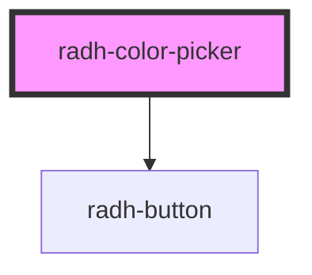

# radh-color-picker

<!-- Auto Generated Below -->

## Properties

| Property       | Attribute       | Description | Type      | Default     |
| -------------- | --------------- | ----------- | --------- | ----------- |
| `defaultValue` | `default-value` |             | `string`  | `"#ff0000"` |
| `resettable`   | `resettable`    |             | `boolean` | `false`     |

## Events

| Event          | Description | Type               |
| -------------- | ----------- | ------------------ |
| `colorChanged` |             | `CustomEvent<any>` |

## Dependencies

### Depends on

- [radh-button](../radh-button)

### Graph

----------------------------------------------

*Built with [StencilJS](https://stenciljs.com/)*
