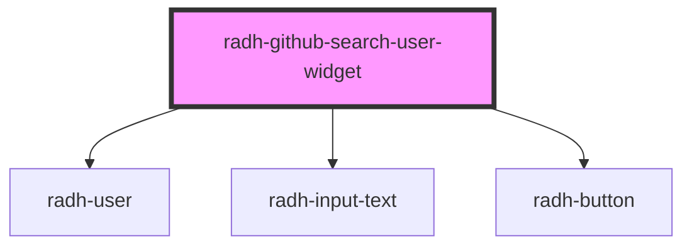

# radh-github-search-user

<!-- Auto Generated Below -->

## Events

| Event          | Description | Type               |
| -------------- | ----------- | ------------------ |
| `userSearched` |             | `CustomEvent<any>` |

## Dependencies

### Depends on

- [radh-user](../radh-user)
- [radh-input-text](../radh-input-text)
- [radh-button](../radh-button)

### Graph

----------------------------------------------

*Built with [StencilJS](https://stenciljs.com/)*
