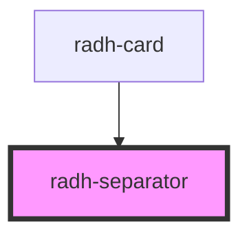

# ic-separator

<!-- Auto Generated Below -->

## Properties

| Property | Attribute | Description | Type     | Default                        |
| -------- | --------- | ----------- | -------- | ------------------------------ |
| `color`  | `color`   |             | `string` | `undefined`                    |
| `height` | `height`  |             | `string` | `'calc(var(--size, 8px) / 8)'` |

## Dependencies

### Used by

 - [radh-card](../radh-card)

### Graph

----------------------------------------------

*Built with [StencilJS](https://stenciljs.com/)*
