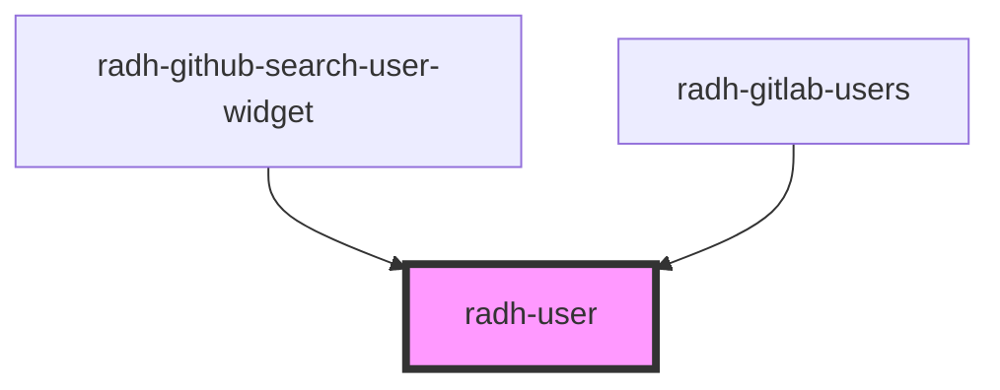

# radh-user

<!-- Auto Generated Below -->

## Properties

| Property | Attribute | Description | Type      | Default     |
| -------- | --------- | ----------- | --------- | ----------- |
| `avatar` | `avatar`  |             | `boolean` | `undefined` |
| `user`   | `user`    |             | `string`  | `undefined` |

## Events

| Event      | Description | Type               |
| ---------- | ----------- | ------------------ |
| `selected` |             | `CustomEvent<any>` |

## Methods

### `setUser(user: User) => Promise<void>`

#### Returns

Type: `Promise<void>`

## Dependencies

### Used by

 - [radh-github-search-user-widget](../radh-gitlab-search-user-widget)
 - [radh-gitlab-users](../radh-gitlab-users)

### Graph

----------------------------------------------

*Built with [StencilJS](https://stenciljs.com/)*
